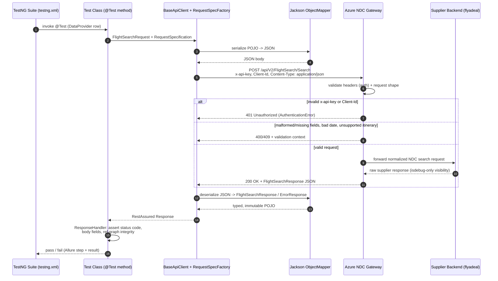

# API Test Automation Framework — Exploration & Architecture (Step 1)

> **Scope of this document:** exploration, data modeling, and architectural
> design only. No test code, no POJOs, no Maven project has been generated
> yet — that begins in Step 2, against the architecture proposed here.

## 0. Why we're starting over

A prior implementation of this suite exists (`Task3_Automation_Project`,
sibling directory). It is functionally correct and was verified against the
live endpoint, but it was built **endpoint-first**: the request spec
factory, config manager, and models all live in a single
`com.tildetech.ndc.automation` package with no separation between "things
that know about HTTP/RestAssured" and "things that know about
FlightSearch." Adding a second endpoint (booking, ancillary services,
seat maps — anything else this supplier or another supplier exposes) would
mean copy-pasting `RequestSpecFactory`, `ConfigManager`, and the
request/response logging setup and re-diverging them over time.

This rebuild's mandate is **maximum reusability**: a `core` layer that has
zero knowledge of FlightSearch, and a `modules/ndc/flightsearch` layer that
contains everything endpoint-specific. A second endpoint should only ever
require a new module directory — never a change to `core`.

One artifact worth carrying forward as-is: `TestCases.md` and
`PROMPT_HISTORY.md` from the prior project document real, live-verified
behavior (exact status codes, error casing, business rules) — that
knowledge is reused throughout Section 2 below and re-verified, not
re-guessed.

**Security note carried forward:** the prior project's `PROMPT_HISTORY.md`
contains the real `x-api-key` value in plaintext and is *not* covered by
`.gitignore` (it's currently untracked/uncommitted, so nothing has leaked
yet, but it will if it's ever `git add`-ed as-is). The new framework must
make this class of mistake structurally harder — see §3.3 (secret handling)
and §4.7 (redaction).

---

## 1. Endpoint under analysis

```
POST /api/V2/FlightSearch/Search
Host: ndc-supplier-integration.azurewebsites.net
```

An NDC (New Distribution Capability) supplier-integration gateway: this
service does not itself hold flight inventory — it's a normalization layer
in front of one or more airline suppliers (the sample data uses `flyadeal`).
That matters architecturally: response shapes, error vocabularies, and
business rules (see §1.4) are per-*supplier*, even though the endpoint
contract is uniform. The framework must model "supplier" as a first-class,
swappable input, not a hardcoded constant.

### 1.1 Headers & transport

| Header | Example | Required | Notes |
|---|---|---|---|
| `x-api-key` | `ttdb2dc2-...-...` | Yes | Bearer-less API key auth. Wrong/absent value → `401`. Treated as a secret — never checked into source. |
| `Client-Id` | `NDC-Core` | Yes | Identifies the *calling application/tenant*, distinct from the supplier being queried. Static per consuming system, not per request. |
| `Content-Type` | `application/json` | Yes | Standard JSON body. |

**Auth flow:** there is no token exchange / OAuth handshake observed — the
`x-api-key` is a long-lived static credential sent on every request. This is
the simplest of the auth strategies the framework needs to support, but the
framework should not assume it's the *only* one a future endpoint will use
(a booking/payment endpoint on the same gateway could plausibly require a
bearer token or HMAC signature). See §3.2 (pluggable `AuthStrategy`).

### 1.2 Request schema

```json
{
  "supplier": "flyadeal",
  "credentialsSelector": "EGY",
  "isdebug": true,
  "searchCriteria": [
    { "origin": "CAI", "destination": "RUH", "date": "2026-09-08" }
  ],
  "passengers": [
    { "passengerTypeCode": "ADT", "count": 3 },
    { "passengerTypeCode": "CHD", "count": 2 },
    { "passengerTypeCode": "INF", "count": 3 }
  ]
}
```

| Field | Type | Required | Analysis |
|---|---|---|---|
| `supplier` | string | Yes | Missing → `400` naming `Supplier` in the error context. Routes the request to a specific airline adapter behind the gateway. |
| `credentialsSelector` | string | Yes (behaviorally) | e.g. `EGY` — selects which market/credential set to use for the chosen supplier. Not yet confirmed whether it's independently validated (omission wasn't part of the verified negative matrix) — flag as an open question for Step 2 exploratory calls. |
| `isdebug` | boolean | No | When `true`, the response gains two extra string fields, `supplierRequest` / `supplierResponse` — the raw wire traffic between the gateway and the upstream supplier. Extremely valuable for **triage during test authoring** (see the raw NDC/OTA XML or JSON the supplier actually returned) but should default to `false`/omitted in the committed positive-scenario fixtures once the framework is stable, to keep payloads realistic. |
| `searchCriteria` | array of `{origin, destination, date}` | Yes, min 1 | **One entry = one-way.** Two entries with reversed origin/destination = round-trip. **Three or more entries, or two entries that don't reverse the same city pair, is treated as a true multi-city itinerary.** `flyadeal` rejects multi-city with `409` — this is a *business rule of the supplier*, not a hard platform limitation, so it must be modeled as data (per-supplier capability), not as a framework-level assumption. `date` must be strict ISO-8601 (`YYYY-MM-DD`); any other format (`DD-MM-YYYY`, slash-delimited, free text) → `400`. |
| `passengers` | array of `{passengerTypeCode, count}` | Yes, min 1 | Observed type codes: `ADT` (adult), `CHD` (child), `INF` (infant) — standard IATA passenger type codes, so the real enum is larger (`YTH`, `SRC`, etc.) even though only three are exercised so far. Missing entirely → `400` naming `Passengers`. |

Two request-shape edge cases worth designing for explicitly rather than
discovering mid-Step-2:

- **IATA city/airport codes are 3-letter strings with no client-side format
  validation modeled** — the framework should not over-constrain these to an
  enum; treat them as opaque strings and let the API be the source of truth
  for validity.
- **`date` is deliberately a raw `String` in the request model, not a typed
  date**, specifically so negative tests can submit syntactically-malformed
  values without the *test framework itself* rejecting them before the
  request is sent. This is a case where "type safety" would actively work
  against the framework's job (provoking real API validation errors) — carry
  this decision forward.

### 1.3 Response schema — success (200)

The response is **not a flat list of self-contained offers**. It's a
normalized/graph-shaped document: shared entities are declared once in
top-level maps, keyed by an ID, and `offers` reference them by ID rather
than embedding them. This is the single most important structural fact for
the framework's response-model design (§4.5).

```json
{
  "responseId": "…",
  "supplier": "flyadeal",
  "journeys": {
    "J1": { "origin": "CAI", "destination": "RUH", "numberOfStops": 0, "segmentRefIds": ["S1"] }
  },
  "flightSegments": {
    "S1": {
      "origin": "CAI", "destination": "RUH",
      "departureDateTime": "2026-09-08T10:00:00", "arrivalDateTime": "2026-09-08T13:30:00",
      "operatingCarrierCode": "F3", "operatingFlightNumber": "123", "equipment": "738"
    }
  },
  "priceClasses": { "PC1": { "priceClassName": "Value", "fareDescription": "…" } },
  "baggageDetails": { "B1": { "carryOnBaggage": "7kg", "checkInBaggage": "20kg" } },
  "offers": [
    {
      "offerId": "…",
      "offerJourneys": ["J1"],
      "passengerFareBreakdown": [
        {
          "passengerTypeCode": "ADT",
          "paxTotalAmount": { "amount": 450.00, "currency": "SAR" },
          "paxBaseAmount": { "amount": 400.00, "currency": "SAR" },
          "paxTotalTaxAmount": { "amount": 50.00, "currency": "SAR" },
          "taxesAndFees": [ { "code": "YQ", "amount": { "amount": 50.00, "currency": "SAR" } } ],
          "segmentDetails": [ { "segmentRefId": "S1", "priceClassRefId": "PC1", "baggageDetailsRefId": "B1", "cabinCode": "Y", "rbd": "V" } ]
        }
      ],
      "priceDetails": { "totalAmount": { "amount": 450.00, "currency": "SAR" } },
      "refundability": "…", "haveBundles": false, "canBeHeld": true
    }
  ],
  "supplierRequest": "…",
  "supplierResponse": "…"
}
```

Key observations:

- **Referential structure**: `Offer.offerJourneys` → keys into `journeys`;
  `Journey.segmentRefIds` → keys into `flightSegments`;
  `SegmentDetail.{priceClassRefId,baggageDetailsRefId}` → key into
  `priceClasses` / `baggageDetails`. A generic **ref-resolution helper**
  (§4.5) that walks `offer → journeys → segments → price class/baggage`
  belongs in `core`, parameterized by the maps and ref fields — assertions
  like "every offer's referenced segments actually exist in
  `flightSegments`" are a *structural integrity* check that has nothing to
  do with FlightSearch specifically and will recur for any endpoint that
  returns this normalized shape.
- **Money is always `{amount, currency}`**, never a bare number — a shared
  `Money` value type belongs in a common models package, not duplicated per
  endpoint.
- **Several fields are deliberately untyped** in the prior implementation
  (`Object rulesAndPenalties`, `Object discount`,
  `Object sellBundleRequiresAncillary`) because their real shape wasn't
  pinned down by the verified scenarios. This is the right call for Step 1
  data modeling — model what's been observed precisely, and leave
  genuinely-unknown-shape fields as `Object`/`JsonNode` rather than
  guessing a structure that silently swallows a future shape change. Jackson
  is configured to ignore unknown properties for exactly this reason
  (forward-compatibility with fields the API adds later).
- **All response models must be immutable value objects deserialized via a
  builder** (the prior project's `@Value @Builder @Jacksonized` pattern) —
  test code should never be able to mutate a captured response mid-assertion.

### 1.4 Error contract — this is the trickiest part of the whole API

The single most important discovery from the prior build, and the thing
most likely to trip up anyone modeling this API from documentation alone:
**the error body shape differs by which layer produced it**, even though
both are JSON with a similar field set.

| Layer | When | Casing | Example status |
|---|---|---|---|
| Gateway / auth | Auth & business-rule rejections | **PascalCase** (`Status`, `ErrorCode`, `ErrorMessage`) | `401` (bad `x-api-key`), `409` (multi-city rejected) |
| Application / validation | Request-shape validation | **camelCase** (`status`, `errorCode`, `errorMessage`) | `400` (missing field, bad date format) |

Both shapes carry the same conceptual fields (`status`, `transactionId`,
`errorCode`, `errorMessage`, `context: [{name, value}]`,
`originalSupplierRequest`, `originalSupplierResponse`). The framework's
answer to this is **one `ErrorResponse` model, deserialized through a
case-insensitive Jackson `ObjectMapper`** (`MapperFeature.ACCEPT_CASE_INSENSITIVE_PROPERTIES`)
rather than two models or a manual branch — this belongs in the shared
`core` Jackson configuration, not per-endpoint, since any other endpoint on
this same gateway almost certainly exhibits the identical dual-casing split
(same gateway front-door, same validation layer underneath).

Confirmed error scenarios (verified against the live API, not assumed):

| Status | Trigger | `errorCode` | Notes |
|---|---|---|---|
| `401` | Invalid `x-api-key` | `AuthenticationError` | `errorMessage` contains "credentials" |
| `400` | Missing `searchCriteria` / `passengers` / `supplier` | (validation) | `context[]` names the missing field |
| `400` | Malformed `date` (wrong format, free text) | (validation) | `context[]` non-empty, doesn't always name the field specifically |
| `409` | True multi-city (3+ distinct cities) for a supplier that doesn't support it | `ValidationError` | `context[]` mentions "multicity"; this is a **per-supplier business rule**, not a platform-wide limit |

Open question for Step 2: what does a *valid* multi-city request look like
for a supplier that *does* support it? The current evidence only proves
`flyadeal` rejects it — the framework's data model for `searchCriteria`
should not bake in "max 2 legs" as a hard client-side rule.

---

## 2. Authentication & environment model

- **Auth mechanism:** static API key, header-based, no expiry/refresh flow
  observed → model as `AuthStrategy.apiKey(String headerName, String value)`
  rather than assuming all future endpoints share this exact mechanism.
- **Multi-tenancy axis (`Client-Id`)** is orthogonal to auth — it identifies
  the *consuming application*, not the credential. Keep it as a distinct
  configurable header, not folded into the auth strategy.
- **Supplier + market axis (`supplier` / `credentialsSelector`)** lives in
  the *request body*, not headers — this is business data, not transport
  auth, and must not be modeled inside the HTTP client layer.
- **Secrets never live in a committed properties file.** Precedence is
  environment-variable-first: the `NDC_API_KEY` environment variable (how
  CI/CD injects a GitHub Secret) → `-D` system property (a local one-off
  override) → fail fast with a clear error. No silent fallback to a
  default/dummy key. Environment-variable-first, rather than the more
  common "`-D` wins" convention, is deliberate here: it means a stray `-D`
  flag on a shared build agent can never silently shadow the credential
  CI/CD actually intends to use.
- **Base URI/path and all non-secret defaults are externalized** to a
  properties file, overridable per-run via `-D`, so the same compiled test
  code can run against a future staging/QA environment without a rebuild.

---

## 3. Architectural principle: `core` knows nothing about FlightSearch

The prior project's flaw was structural, not functional: `RequestSpecFactory`,
`ConfigManager`, and the Jackson setup were correct, but they lived in the
same package as FlightSearch-specific data providers and tests, with
FlightSearch defaults (`api.supplier`, `api.credentialsSelector`) baked into
the shared `ConfigManager`. The fix is a hard package boundary:

- **`core`** — HTTP client, request spec factory, auth strategies, config
  loading, Jackson setup, generic response/error handling, ref-resolution
  utilities, reporting/logging filters, the abstract base test class.
  *Nothing in this layer imports or references FlightSearch, `flyadeal`, or
  any other domain concept.*
- **`modules/<supplier-or-domain>/<endpoint>`** — request/response POJOs,
  data providers, request builders, and (in a later step) test classes for
  one specific endpoint. A second endpoint means a new sibling directory
  under `modules/`, wiring itself to `core` the same way FlightSearch does.

### 3.1 Base API Client

A thin, generic wrapper over RestAssured — not a re-implementation of it.
Responsibilities: accept a `RequestSpecification` + a body, execute
`GET/POST/PUT/PATCH/DELETE`, and return the raw `Response`. It does **not**
know about status codes, error models, or deserialization targets — that's
the Response Handler's job (§3.4). Keeping this layer dumb is what makes it
reusable: a booking endpoint's `POST` looks identical to FlightSearch's
`POST` at this layer.

### 3.2 Request Spec Factory (generalized)

Today's factory hardcodes one base URI, one base path, and one fixed header
set. The generalized version takes a small `ServiceConfig` value object
(`baseUri`, `basePath`, `staticHeaders`, `authStrategy`) so the same factory
class builds specs for *any* endpoint/service, not just FlightSearch. The
FlightSearch module supplies its own `ServiceConfig` (derived from
`ConfigManager`); a future booking module supplies its own. Cross-cutting
concerns — request/response logging filters, the Allure filter, the shared
Jackson `ObjectMapper` — are attached once, here, for every spec regardless
of which service config it was built from.

### 3.3 Config layer

Generalized from "one flat properties file with FlightSearch-specific keys"
to a layered model: **framework-level keys** (base URI, timeouts, log
level) live under one namespace; **per-module defaults** (`supplier`,
`credentialsSelector`, invalid-key fixture) live under a module-prefixed
namespace (e.g. `ndc.flightsearch.supplier=flyadeal`) so `core`'s
`ConfigManager` stays domain-agnostic and a module simply reads its own
prefixed keys through the same generic `get(key)` primitive.

### 3.4 Response Handler

A generic utility that takes a `Response` and a target success type,
inspects the status code, and returns either the deserialized success POJO
or throws/returns a deserialized `ErrorResponse` — so test code (in a later
step) writes `handler.expectSuccess(response, FlightSearchResponse.class)`
or `handler.expectError(response, 400)` instead of repeating
`.statusCode(x).extract().response()` + manual `.as(...)` in every test
method. This is where the case-insensitive `ErrorResponse` mapping (§1.4)
gets applied uniformly.

### 3.5 Ref-resolution helper

A small generic utility, `RefGraph<K, V>` or similar, wrapping a `Map<K, V>`
plus a lookup method that throws a clear, assertion-friendly error if a
referenced key is absent — used to validate the `offers → journeys →
segments → priceClasses/baggageDetails` chain (§1.3) without every test
re-implementing map lookups. Lives in `core` because any endpoint returning
this normalized shape benefits from it, not just FlightSearch.

### 3.6 Models: shared vs. domain

`Money`, `ErrorResponse`, and `ErrorContext` are strong candidates for a
`core.models.common` package — they're generic API concepts (a monetary
value, a standard error envelope), not FlightSearch concepts. Everything
else in §1.3/§1.2 (journeys, segments, offers, passengers, search criteria)
is FlightSearch-specific and lives in the module.

### 3.7 Reporting & cross-cutting filters

Request/response logging, the Allure RestAssured filter, and **secret
redaction** (masking `x-api-key` and similarly-named header/body values
before they're logged or attached to a report) belong in `core` as
composable RestAssured filters, applied by the Request Spec Factory to
every spec — this is precisely the mechanism that should have prevented a
raw key from ever reaching a plaintext file in the first place, and
generalizing it now means every future module inherits the protection
automatically instead of re-implementing it.

### 3.8 Full request/response lifecycle (sequence diagram)

One test method's HTTP call, end to end — header-based authentication,
POJO⇄JSON serialization on both sides of the wire, and the assertion layer
that closes the loop. This is the same call flow rendered as an inline SVG
at the top of `Execution_QA_Report.html` (see §8's "Executive QA report"
section below); this Mermaid copy is the portable, renders-anywhere version
for anyone reading the repo on GitHub.



Two things this diagram makes explicit that are easy to miss from the code
alone: the `alt` branch is where the two-casing error contract from §1.4
actually lives (the same `ErrorResponse` POJO absorbs either outcome via
the case-insensitive `ObjectMapper`), and Jackson appears on **both**
sides of the gateway call — serialization going out, deserialization
coming back — which is exactly why `JacksonConfig` is shared, single
source of truth rather than configured twice.

---

## 4. Proposed directory structure

```
api-test-automation-framework/
├── README.md
├── pom.xml
├── testng.xml
├── .gitignore
├── .github/
│   └── workflows/
│       └── test-automation.yml
└── src/test/
    ├── resources/
    │   └── config/
    │       └── config.properties         # framework + per-module non-secret defaults
    └── java/com/tildetech/automation/
        ├── core/                         # zero domain knowledge — reusable by any endpoint
        │   ├── client/
        │   │   └── ApiClient.java              generic HTTP verb wrapper over RestAssured
        │   ├── config/
        │   │   ├── ConfigManager.java           generic key lookup, -D > env > properties file
        │   │   └── ServiceConfig.java           {baseUri, basePath, staticHeaders, authStrategy}
        │   ├── auth/
        │   │   ├── AuthStrategy.java             interface
        │   │   └── ApiKeyAuthStrategy.java        header-based static key (this API's mechanism)
        │   ├── specs/
        │   │   └── RequestSpecFactory.java        builds specs from a ServiceConfig
        │   ├── json/
        │   │   └── ObjectMapperFactory.java        shared Jackson config (case-insensitive, JSR-310, ignore-unknown)
        │   ├── response/
        │   │   ├── ApiResponseHandler.java         status-driven success/error deserialization
        │   │   └── RefGraph.java                   generic ID-ref resolution helper
        │   ├── filters/
        │   │   ├── SecretRedactionFilter.java      masks configured header/body values in logs & Allure
        │   │   └── (logging / Allure filters)
        │   ├── models/
        │   │   └── common/
        │   │       ├── Money.java
        │   │       ├── ErrorResponse.java
        │   │       └── ErrorContext.java
        │   └── base/
        │       └── BaseApiTest.java               generic TestNG base; module base tests extend this
        └── modules/
            └── ndc/
                └── flightsearch/
                    ├── config/
                    │   └── FlightSearchConfig.java     module's ServiceConfig + module-prefixed defaults
                    ├── models/
                    │   ├── request/
                    │   │   ├── FlightSearchRequest.java
                    │   │   ├── SearchCriteria.java
                    │   │   └── PassengerRequest.java
                    │   └── response/
                    │       ├── FlightSearchResponse.java
                    │       ├── Journey.java
                    │       ├── FlightSegment.java
                    │       ├── Offer.java
                    │       ├── PassengerFareBreakdown.java
                    │       ├── SegmentDetail.java
                    │       ├── PriceDetails.java
                    │       ├── PriceClass.java
                    │       ├── BaggageDetail.java
                    │       └── TaxFee.java
                    ├── data/
                    │   └── FlightSearchRequestFactory.java   builders/fixtures (replaces today's DataProvider-coupled builders)
                    └── tests/                                 # intentionally empty — Step 2+
```

Everything under `modules/ndc/flightsearch` is what a second endpoint would
*not* reuse; everything under `core` is what it would. That split is the
concrete, checkable definition of "reusability" for this project — if a
future module has to modify anything under `core/`, the abstraction was
wrong.

### 4.1 Implementation status (Step 3)

The tree above was Step 1's proposal, written before any code existed.
Step 3 implemented the core engine against a **simplified package layout**
that keeps the same `core`-vs-domain separation principle but drops the
`com.tildetech.automation` nesting and the `core`/`modules` folder names in
favor of flatter, equally-descriptive top-level packages — and puts it all
under `src/main/java`, not `src/test/java`, since this is now a reusable
library the (future) test layer depends on rather than test code itself:

```
src/main/
├── resources/
│   └── config.properties                  # api.baseUri, api.clientId (no secrets)
└── java/
    ├── config/
    │   └── ConfigManager.java             # was core/config/ConfigManager.java
    ├── api/
    │   ├── base/                          # was core/{client,specs,response,json}/
    │   │   ├── BaseApiClient.java         # was core/client/ApiClient.java
    │   │   ├── RequestSpecFactory.java    # was core/specs/RequestSpecFactory.java
    │   │   ├── ResponseHandler.java       # was core/response/ApiResponseHandler.java
    │   │   └── JacksonConfig.java         # was core/json/ObjectMapperFactory.java
    │   └── endpoints/                     # was modules/ndc/flightsearch/ (API layer only)
    │       └── FlightSearchApi.java
    └── models/
        ├── common/                        # unchanged from the original proposal
        │   ├── Money.java
        │   ├── ErrorResponse.java
        │   └── ErrorContext.java
        ├── request/
        │   ├── FlightSearchRequest.java
        │   ├── SearchCriteria.java
        │   └── Passenger.java             # renamed from PassengerRequest.java
        └── response/
            ├── FlightSearchResponse.java
            ├── Journey.java
            ├── FlightSegment.java
            ├── Offer.java
            ├── PassengerFareBreakdown.java
            ├── SegmentDetail.java
            ├── PriceDetails.java
            ├── PriceClass.java
            ├── BaggageDetail.java
            └── TaxFee.java
```

Deliberately **not yet built** (still proposals, not code): `ServiceConfig`
+ pluggable `AuthStrategy` (today's `RequestSpecFactory` talks to
`ConfigManager` directly, since there's only one service/auth mechanism to
support so far — introduce the abstraction when a second one actually
shows up, not before), `RefGraph` (the ref-resolution helper — no test code
exists yet to consume it), `SecretRedactionFilter` (the logging/Allure
filters are wired up, but redaction specifically is still open), and
`BaseApiTest` / `FlightSearchRequestFactory` / anything under `tests/`
(that's `src/test/java`, explicitly out of scope until the next step).
`FlightSearchApi` composes a `BaseApiClient` rather than extending it, so
its public surface exposes only `executeSearch(...)`, not raw HTTP verbs.

---

## 5. Open questions to resolve before/during Step 2

1. Does `credentialsSelector` have its own independent validation error, or
   is it silently ignored if invalid? (Not covered by the prior verified
   matrix.)
2. What does a *supported* round-trip look like structurally in the
   response — do `journeys` for the outbound/return leg share any offers,
   or does each leg get fully independent offers? Affects whether
   `RefGraph` needs to reason about multiple journeys per offer beyond the
   simple one-way case.
3. Are there rate limits or throttling on this shared/live endpoint that
   the framework needs to account for (test ordering, parallelism limits in
   `testng.xml`)?
4. Full IATA passenger-type-code enum (`YTH`, `SRC`, etc.) — worth
   confirming which are actually accepted by this supplier vs. which are
   part of the spec but unsupported.
5. Whether other suppliers behind this same gateway support true
   multi-city — needed to confirm the 409 is genuinely per-supplier and not
   a platform-wide cap, before the data model commits to "multi-city
   capability" as a per-supplier flag.

---

## 6. Implementation status (Step 4: test suite)

`src/test/java` now implements every **confirmed** (`Needs Automation: Yes`)
row from TestCases.md — 16 positive scenarios, 57 negative scenarios, 73
total — and deliberately none of the `[UNCONFIRMED]` ones, per the
discipline TestCases.md itself lays out: asserting on a guessed status code
would encode a wrong assumption as if it were spec.

```
src/test/java/
├── base/
│   └── BaseTest.java              # env fail-fast check + @Step-wrapped call helpers
├── providers/
│   └── FlightSearchDataProvider.java   # every fixture, keyed back to its TC ID(s)
└── tests/
    ├── FlightSearchPositiveTests.java   # 9 @Test methods, 16 scenarios
    └── FlightSearchNegativeTests.java   # 18 @Test methods, 57 scenarios
```

Tests are split by **expected outcome** (200 vs. everything else), not by
TestCases.md's category column — TC_DATE_012 (a valid leap day) and
TC_AUTH_009 (header-name case-insensitivity) both assert on a 200, so both
live in `FlightSearchPositiveTests` despite their category names. Each
`@Test`'s Javadoc/`@Description` states exactly which TC ID(s) it covers, so
the mapping back to TestCases.md is always one grep away.

**A discovery worth recording:** several TC_TYPE rows (count as a string,
`searchCriteria` as an object, etc.) describe a genuine JSON *type or shape*
mismatch — something the strongly-typed request POJOs from Step 3 cannot
produce by construction (there's no builder call that puts a `String` where
an `Integer` field expects one). Those rows, plus the pure-JSON-syntax-error
and explicit-null-date cases, are sent as raw JSON text blocks via
`BaseTest#searchRaw` instead of through `FlightSearchApi`. This is the same
tension already called out for `SearchCriteria.date` in §1.2 — kept
consistent rather than solved differently in two places — and it means
`FlightSearchApi`'s POJO-typed `executeSearch(...)` doesn't need to loosen
its own contract just to support a handful of negative tests.

`pom.xml` and `testng.xml` were updated to actually run this suite:
`maven-surefire-plugin` now wires the AspectJ weaver Allure's `@Step`
annotation needs (`@Epic`/`@Feature`/`@Story`/`@Severity` are plain
reflection and work without it) and points at `testng.xml`, which runs the
two test classes as separate parallel `<test>` blocks.

---

## 7. Prerequisites & environment setup

- **JDK 17** (Temurin, Oracle, or any 17 LTS distribution)
- **Maven 3.9+**
- **Node.js 18+** (only needed to generate `Execution_QA_Report.html` — the
  test suite itself has no Node dependency)
- Network access to `ndc-supplier-integration.azurewebsites.net` — this
  suite calls the **live** API; there is no mock/stub server

Verify your environment:

```bash
java -version
mvn -v
node -v
```

Resolve dependencies with:

```bash
mvn -B dependency:resolve
```

### Configuration

Non-secret values live in `src/main/resources/config.properties` (base URI,
`Client-Id` default). Any key can be overridden per-run without editing the
file:

```bash
mvn test -Dapi.baseUri=https://staging.example.com
```

### Secrets — the API key (and, optionally, Client-Id)

`ConfigManager` resolves each value in a fixed precedence order — see
`ConfigManager.java` for the authoritative logic:

| Value | Precedence | Required? |
|---|---|---|
| API key | `NDC_API_KEY` env var → `-Dapi.key` → **fail fast** | Yes — no default, ever |
| Client-Id | `NDC_CLIENT_ID` env var → `-Dapi.clientId` → `config.properties`'s `NDC-Core` default | No — has a safe local default |

Precedence is environment-variable-first for both — the opposite of the
more common "`-D` wins" convention — specifically so a GitHub Secret
injected as an environment variable in CI can never be silently shadowed by
a stray `-D` flag on a shared build agent. `-D` remains available as a
local one-off override for whenever no environment variable is set.

The API key is never written to `config.properties` or committed to source
control. Locally:

```bash
# bash
export NDC_API_KEY="<your-key>"
mvn test

# PowerShell
$env:NDC_API_KEY = "<your-key>"
mvn test

# one-off, no env var
mvn test -Dapi.key=<your-key>
```

In GitHub Actions: add repository secrets **`NDC_API_KEY`** (required) and
**`NDC_CLIENT_ID`** (optional — omit it and CI falls back to the same
`NDC-Core` default local runs use) under **Settings → Secrets and
variables → Actions → New repository secret**. The workflow already passes
both through — see [CI/CD](#9-cicd) below.

---

## 8. Running the suite

```bash
mvn test
```

Runs `testng.xml`, which executes `FlightSearchPositiveTests` and
`FlightSearchNegativeTests` in parallel (the "Positive Scenarios" /
"Negative Scenarios" `<test>` blocks). Results land in
`target/surefire-reports` and `target/allure-results`.

### Running a subset

Surefire's `-Dtest` flag narrows to specific classes/methods without
touching `testng.xml`:

```bash
# one class
mvn test -Dtest=FlightSearchPositiveTests

# one method
mvn test -Dtest=FlightSearchNegativeTests#multiCityItineraryReturns409

# a class plus one method from another
mvn test -Dtest=FlightSearchPositiveTests,FlightSearchNegativeTests#invalidOrEmptyApiKeyReturns401
```

`BaseTest`'s `@BeforeSuite` environment check still runs first regardless —
a subset run fails immediately with a clear message if the API key isn't
configured, rather than failing confusingly partway through.

### Generating and viewing the Allure report locally

```bash
mvn allure:serve      # builds the report and opens it in your default browser
```

Or, for a static copy you can archive or host elsewhere:

```bash
mvn allure:report     # writes to target/site/allure-maven-plugin/index.html
```

Every test's request/response pair is attached automatically via
`allure-rest-assured`, and tests are grouped by `@Epic` / `@Feature` /
`@Story` / `@Severity` for easy drill-down.

### Executive QA report (`Execution_QA_Report.html`)

A second, purpose-built report sits alongside Allure: a single
self-contained HTML file aimed at a non-technical audience and at clean PDF
export (print it via the in-page button, or `Ctrl`/`Cmd`+`P`), generated by
the [`ndc-api-reporter` skill](.agent/skills/ndc-api-reporter/SKILL.md) from
the same `target/allure-results` Allure already produces.

```bash
npm test           # mvn clean test, then regenerates Execution_QA_Report.html
# or, if you already ran a *clean* `mvn test` separately:
npm run report      # equivalent to: node .agent/skills/ndc-api-reporter/generate_report.js
```

`npm test` always runs `mvn clean test` (not just `test`) — `allure-results`
accumulates across runs otherwise, and a bare re-run would double-count
stale results from the previous one.

The script has zero npm dependencies (parses Allure's JSON/HTML result
files directly with `fs` + regex), so no `npm install` step is needed. It
includes: a prominent header with structured environment metadata (base
URL, test framework + JDK/Maven versions, execution mode, supplier config,
generated-at timestamp, run duration — each detected from the actual
project files/machine, never hardcoded); an inline-SVG architecture/call-flow
diagram (no Mermaid CDN dependency, so it still renders with the report
opened offline — see §3.8 for the same diagram in Mermaid form); KPI cards +
a colorblind-safe status donut aligned to the right; search + status/category
filters plus a red "Reset Filters" control and a "no matching test cases"
empty state; a dedicated "Failed & Blocked Issues" section; and per-category
accordions (category = each test's `@Story`). `x-api-key` (and
similarly-named header) values are automatically masked wherever they
appear in a captured payload, so the report is safe to share or archive
even though it embeds full request/response bodies. Each card's `RUN-*`
label is a run-sequence marker, **not** a TestCases.md ID — several test
methods here are data-driven across multiple TestCases.md rows in one call,
so there's no honest 1:1 mapping to fabricate. The real `TC_*` ID(s) for a
test are in its description text (from `@Description`) shown on the card,
and that text is included in the search index — searching `TC_FLD_002`
finds the right card.

`Execution_QA_Report.html` is a generated artifact (gitignored, like
`target/`) — CI regenerates and uploads it on every run.

---

## 9. CI/CD

[`.github/workflows/test-automation.yml`](.github/workflows/test-automation.yml)
runs on every push and pull request targeting `main`/`master` (and supports
manual triggering via `workflow_dispatch`):

1. Checks out the repository.
2. Sets up JDK 17 (Temurin) via `actions/setup-java`, with its built-in
   Maven dependency cache enabled.
3. Sets up Node.js (`actions/setup-node`) for the executive report
   generator.
4. Runs `mvn -B clean test` — the full positive + negative TestNG suite
   against the live API — with `NDC_API_KEY` and `NDC_CLIENT_ID` injected
   from the matching repository secrets (see
   [Secrets](#secrets--the-api-key-and-optionally-client-id) above).
   `clean` (not a bare `test`) keeps `target/allure-results` from
   accumulating stale results across runs.
5. Generates `Execution_QA_Report.html` and uploads it as a build artifact
   (`execution-qa-report`).
6. Generates the Allure HTML report (`mvn -B allure:report`) and uploads it
   (`allure-report`), alongside the raw `allure-results` and
   `surefire-reports`.

Steps 5–6 and all artifact uploads run with `if: always()`, so a failed run
still produces every report — which matters most for the executive report,
since that's exactly when its "Failed & Blocked Issues" section has
content.

To review a run: open it in the **Actions** tab and download whichever
artifact you need. `execution-qa-report` is a single HTML file — open it
directly, no server needed. `allure-report` needs to be served rather than
opened via `file://` (e.g. `npx http-server target/site/allure-maven-plugin`
or `python -m http.server` from inside the extracted folder).

---

## 10. Extending the suite

- **A new endpoint module** (Booking, SeatMap, ...): add a new
  `api.endpoints.<Name>Api` shaped like `FlightSearchApi` — a resource-path
  constant composed with `BaseApiClient` — plus its own `models.request`/
  `models.response` POJOs. Nothing under `api.base` or `config` should need
  to change; if it does, that's a signal the "generic core" abstraction
  leaked something endpoint-specific.
- **New FlightSearch scenarios**: add a case to
  `FlightSearchDataProvider`, or a dedicated `@Test` method for a genuine
  one-off.
- **New response fields**: extend the relevant response POJO — every
  response model ignores unknown JSON properties, so partial modeling never
  breaks deserialization.
- **Promoting an `[UNCONFIRMED]` TestCases.md row**: run the exploratory
  spike described in TestCases.md's closing section, record the real
  status/body shape, then add it to `FlightSearchDataProvider` +
  the matching test method exactly like every confirmed row already there.
